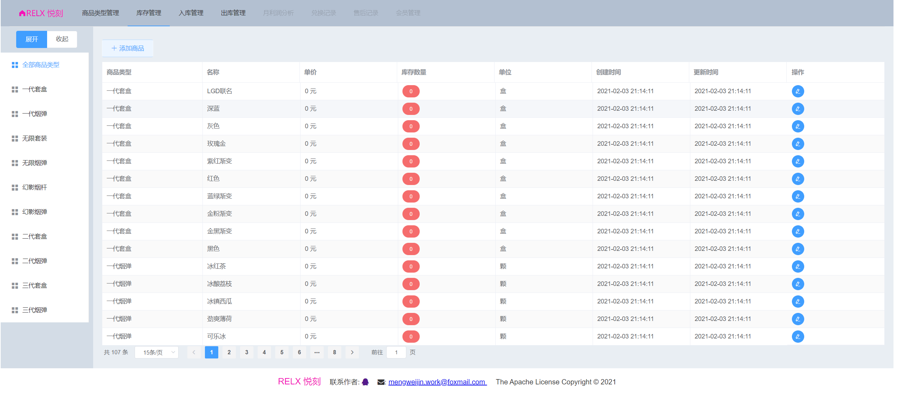
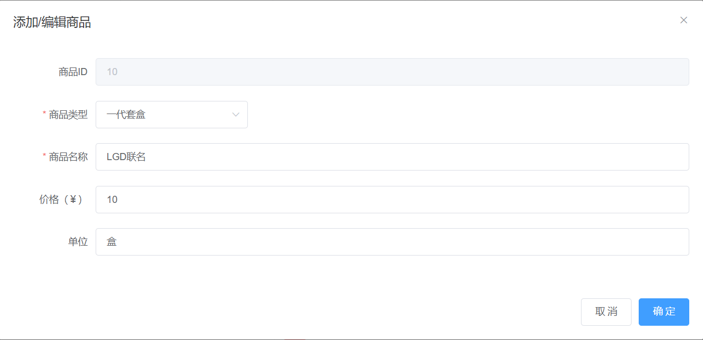
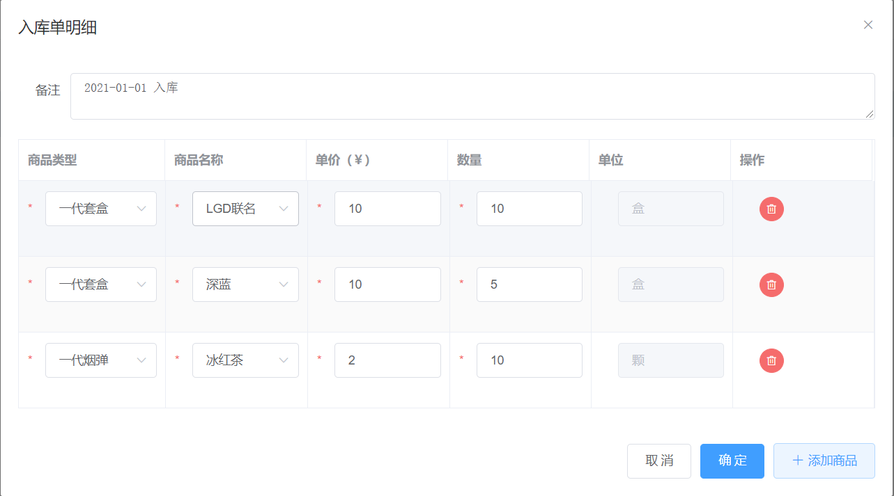
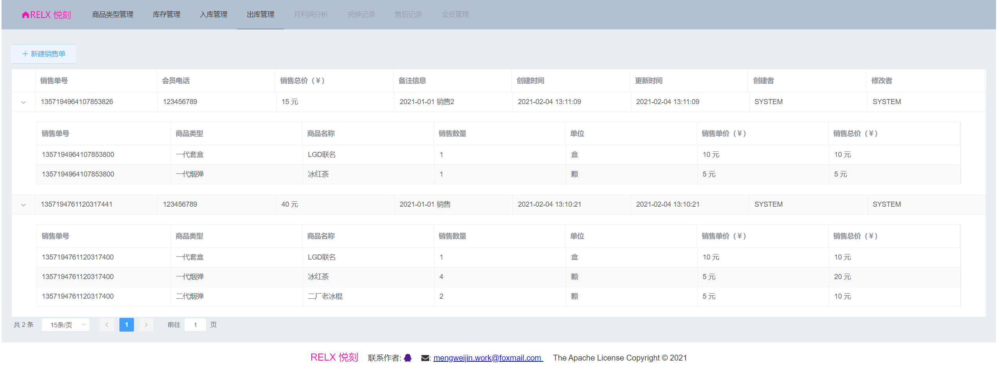

# relx-club-invoicing-management-system

#### Description
悦刻 RELX Club Invoicing management system

#### Software Technology
* Front-end：Vue3, Element-Plus
* Back-end：SpringBoot, MyBatis-Plus
* Container Deployment：Docker, Nginx, Tomcat

#### Installation

1. Install docker
   * linux or windows professional edition system reference https://docs.docker.com docker individual mounting part.
   * windows home edition system reference：https://docs.docker.com/docker-for-windows/install-windows-home/

Note: Remember to configure the domestic Docker source, otherwise the download image will be very slow.

2.  Install the front-end UI：
````
$ docker run --name relx-ui --restart=always -p 80:80 -d registry.cn-hangzhou.aliyuncs.com/mengweijin/relx-ui:latest
````
3.  Install back-end services：
````
$ docker run --name relx-club-invoicing-management-system --restart=always -d -p 8081:8081 registry.cn-hangzhou.aliyuncs.com/mengweijin/relx-club-invoicing-management-system:latest
````
4. visvit page: http://localhost:80

#### Web Presentation







#### Contribution

1.  Fork the repository
2.  Create Feat_xxx branch
3.  Commit your code
4.  Create Pull Request
