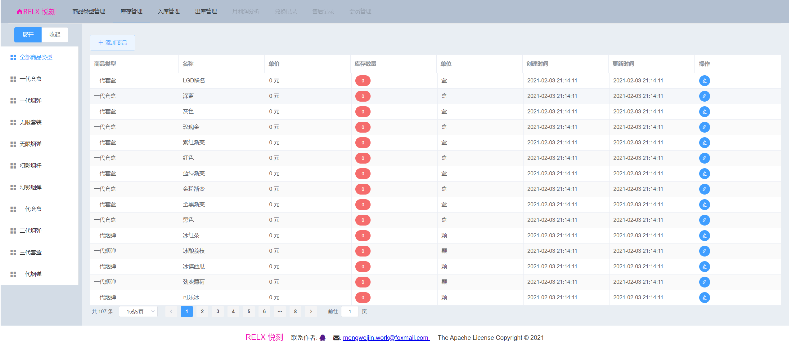
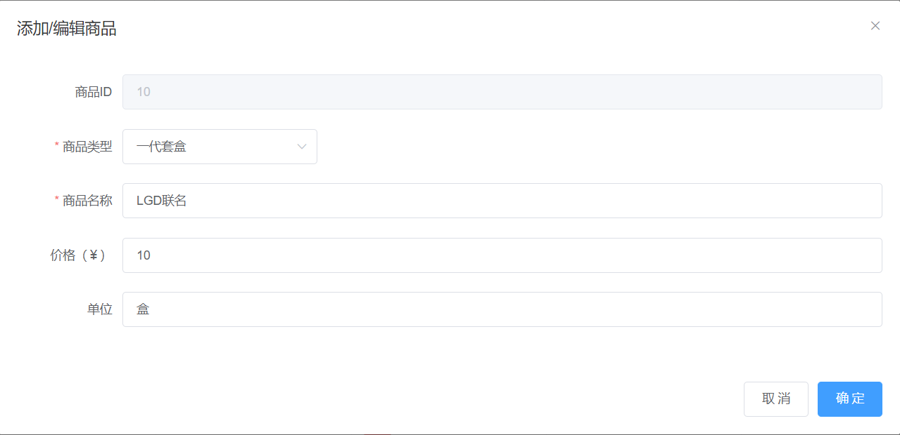
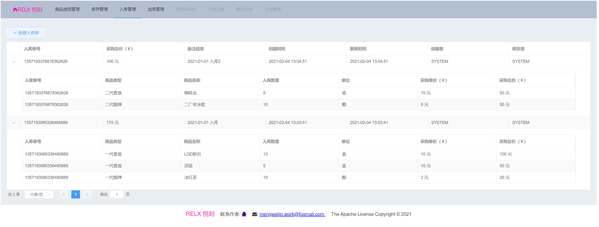
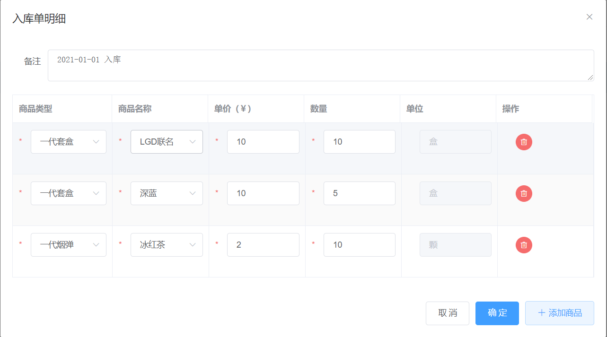
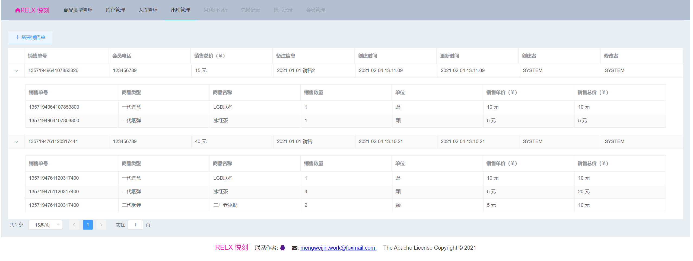
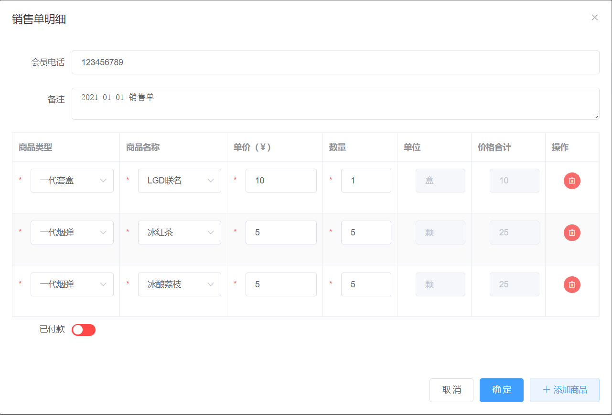

# relx-club-invoicing-management-system

#### 介绍
悦刻 RELX Club Invoicing management system

#### 软件技术
* 前端：Vue3, Element-Plus
* 后端：SpringBoot, MyBatis-Plus
* 容器部署：Docker, Nginx, Tomcat

#### 安装教程
1. 安装 docker
    * linux/windows专业版 系统参考 https://docs.docker.com docker 各自安装部分。
    * windows家庭版系统参考：https://docs.docker.com/docker-for-windows/install-windows-home/
    
注意：记得配置国内docker源，否则下载镜像的速度非常慢。

2.  安装前端UI：
````
$ docker run --name relx-ui --restart=always -p 80:80 -d registry.cn-hangzhou.aliyuncs.com/mengweijin/relx-ui:latest
````
3.  安装后端服务：
````
$ docker run --name relx-club-invoicing-management-system --restart=always -d -p 8081:8081 registry.cn-hangzhou.aliyuncs.com/mengweijin/relx-club-invoicing-management-system:latest
````
4. 访问页面 http://localhost:80

#### 页面展示







#### 参与贡献

1.  Fork 本仓库
2.  新建 Feat_xxx 分支
3.  提交代码
4.  新建 Pull Request

